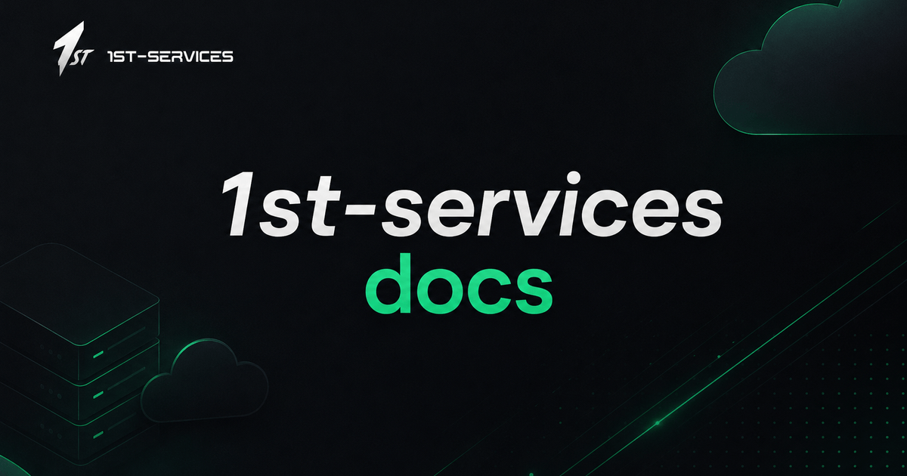

  

   
   

  <h1>1st Services Documentation</h1>

  

    <strong>The official developer documentation and API reference for 1st Services.</strong> 
    High-Performance NVMe VPS Compute, Managed Databases, Smart URL Shortener, Disposable Temp Mail APIs, and Enterprise Cloud Infrastructure.
  

  

    
    
    
    
    
  

---

## Official Links & Resources

| Resource                 | URL                                                          | Description                                               |
| :----------------------- | :----------------------------------------------------------- | :-------------------------------------------------------- |
| **Documentation Portal** | [docs.1st-services.com](https://docs.1st-services.com)       | Official guides, SDKs, and REST API references            |
| **1st Services Console** | [1st-services.com](https://1st-services.com)                 | Cloud management dashboard for VPS and databases          |
| **Discord Community**    | [discord.gg/1stservices](https://discord.gg/1stservices)     | Connect with engineers, ask questions, and share feedback |
| **GitHub Organization**  | [github.com/1st-services](https://github.com/1st-services)   | Open-source SDKs, CLI tools, and libraries                |
| **Twitter / X**          | [x.com/1stservices](https://x.com/1stservices)               | Product releases, platform updates, and announcements     |
| **System Status**        | [status.1st-services.com](https://status.1st-services.com)   | Real-time service health, uptime, and incident reports    |
| **Developer Support**    | [1st-services.com/support](https://1st-services.com/support) | Dedicated technical support and enterprise helpdesk       |

---

## License

Copyright &copy; 2026 **1st-services**. All rights reserved.

All documentation, source code, designs, and brand assets are proprietary to [1st Services](https://1st-services.com). See [LICENSE](LICENSE) for details.
